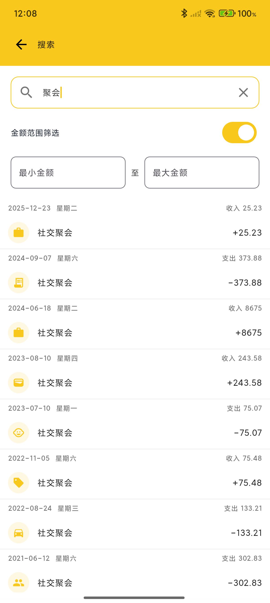
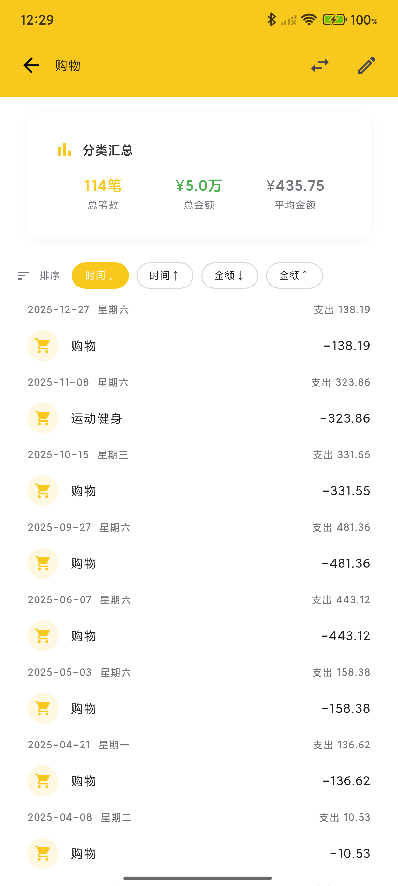
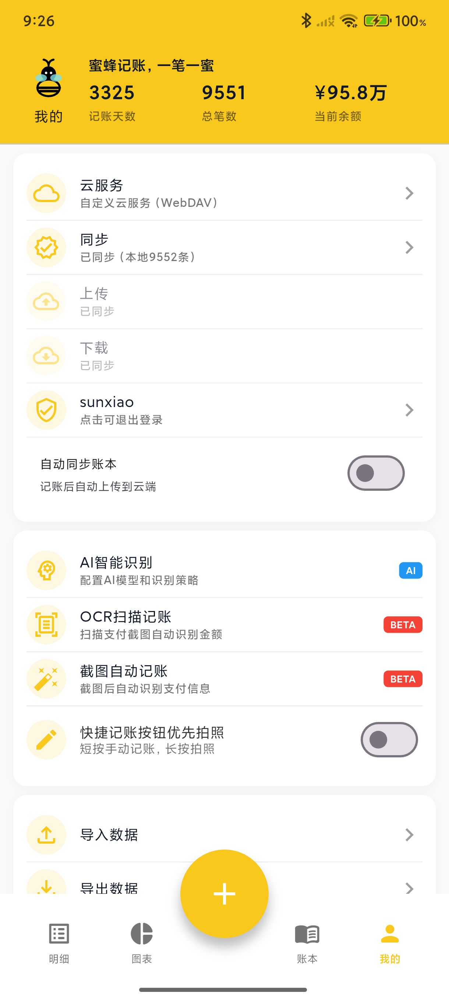
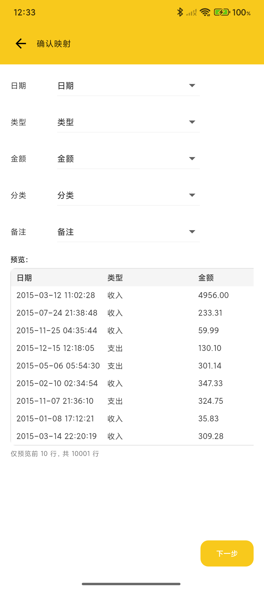

# 蜜蜂记账（BeeCount）

<div align="center">


**你的数据，你做主的开源记账应用**

**核心优势：支持自建 Supabase/WebDAV 服务器，数据完全掌控在你手中**

<br/>

<a href="https://github.com/TNT-Likely/BeeCount/releases/latest">
  
</a>
<a href="https://apps.apple.com/app/id6754611670">
  
</a>
<a href="https://testflight.apple.com/join/Eaw2rWxa">
  
</a>

<br/>
<br/>

[📖 使用文档](#-使用说明) | [💝 捐赠支持](#-捐赠) | [🌐 English](README_EN.md)

</div>

---

> ## 🎉 重大消息
>
> **🍎 iOS 正式版已上架 App Store！**
>
> 在 App Store 搜索 **"蜜蜂记账-简洁记账本"** 即可下载安装
>
> ---
>
> **🚀 支付宝/微信自动记账，全程 0 操作！**
>
> 📸 **拍照识别** - AI 自动提取金额、商家、分类信息（本地模型训练中 + GLM 云端模型）
>
> ⚡ **截图记账** - Android 截图监听 + iOS 快捷指令，支付后自动创建账单

---

> ## 💬 加入微信交流群
>
> <div align="center">
>   
>
> **扫码加入微信群，获取最新动态、功能建议、问题反馈**
> </div>

---

> ## 🎨 招募设计师
>
>
> **我们正在寻找有才华的 UI/UX 设计师加入蜜蜂记账项目！**
>
> 📐 **参与内容：**
>
> - 重新设计应用 UI 和交互体验
> - 设计主题皮肤和插画元素
> - 优化用户界面的视觉一致性
> - 创建现代化、简洁的设计语言
>
> 🎁 **你将获得：**
>
> - 开源项目作品集积累
> - 在 README 和应用中署名
> - 与开发团队密切合作的机会
> - 为数千用户打造优质体验的成就感
>
> 💌 **联系方式：**
>
> - GitHub Issues: [提交设计建议](https://github.com/TNT-Likely/BeeCount/issues)
> - 微信群：扫描上方二维码

---

> ## 📱 平台支持
>
> 🤖 **Android** - [下载 APK](https://github.com/TNT-Likely/BeeCount/releases/latest) | 支持 Android 5.0+
>
> 🍎 **iOS** - [App Store 正式版](https://apps.apple.com/app/id6754611670) | [TestFlight 公测版](https://testflight.apple.com/join/Eaw2rWxa) | 支持 iOS 15.5+
>
> 📱 **HarmonyOS** - 正在上架中 | 支持 HarmonyOS 5.0+ | [鸿蒙版本仓库](https://github.com/TNT-Likely/beecount-openharmony)

---

## 💡 为什么选择蜜蜂记账？

<table>
<tr>
<td width="50%">

### 🔒 传统记账应用的问题

- ❌ 数据存储在第三方服务器
- ❌ 隐私无法保证，可能被分析利用
- ❌ 服务商倒闭数据可能丢失
- ❌ 高级功能需要付费订阅
- ❌ 强制广告和理财产品推荐
- ❌ 闭源软件，无法审计代码

</td>
<td width="50%">

### ✅ 蜜蜂记账的优势

- ✅ **自建服务器**，数据完全自主
- ✅ **开源透明**，代码可审计
- ✅ **离线优先**，无网也能用
- ✅ **个人免费**，无广告无付费墙（包括自动记账等核心功能）
- ✅ **隐私保护**，开发者无法访问你的数据
- ✅ **源代码公开**，代码可审计

</td>
</tr>
</table>

一款轻量、开源、隐私可控的**个人财务管理**和**支出追踪** App，支持 iOS/Android 双平台。内置完整的账本管理、**收支记录**、**截图自动记账**、分类统计、**图表分析**、数据导入导出功能，并支持自建 Supabase/WebDAV 云服务器同步。适合注重隐私的个人和家庭进行日常**费用记录**和**收支管理**。

## 📱 核心功能展示

<div align="center">
  
  
  
  
</div>

<details>
<summary>📸 查看更多截图</summary>

### 数据管理功能

<div align="center">
  
  
  
  
</div>

### 个性化与管理

<div align="center">
  
  
  
  
</div>

### 数据导入导出

<div align="center">
  
</div>

</details>

## 🌟 核心特性

### ☁️ 自建云服务 - 核心差异化优势

> **这是蜜蜂记账最大的特色：数据完全由你掌控！**

| 自建方案 | 适用场景 | 特点 |
|---------|---------|------|
| **Supabase** | 无 NAS 的用户 | 免费额度充足、配置简单、云端托管 |
| **WebDAV** | 有 NAS 的用户 | 数据完全本地化、支持群晖/绿联云/Nextcloud |

**为什么选择自建？**

- 🔐 **隐私第一**：开发者无法访问你的数据
- 💰 **成本可控**：Supabase 免费额度够用，WebDAV 一次性投入
- 🛡️ **数据安全**：不担心服务商倒闭或数据泄露
- 🔓 **开源审计**：所有云同步代码开源，可审计

[📖 查看云服务配置教程](#️-云备份配置可选)

### 🔒 数据安全与隐私

- **离线优先**：基于本地 SQLite，无网也能用
- **开源透明**：源代码公开，代码可审计
- **可选同步**：不配置云服务也能完整使用
- **零追踪**：无统计、无广告、无数据收集

### 🤖 智能自动记账 - 一键记录支付信息

> **🌟 核心功能亮点：截图即记账，支付信息自动识别！**

**Android 自动记账**：

- 📸 **无障碍服务自动记账**：启用后，每次截图自动识别支付信息并记账
- 🎯 **智能识别**：自动识别支付宝、微信支付、云闪付等主流支付方式
- ⚡ **实时记录**：支付完成后截图，立即自动记录交易信息

**iOS 自动记账**：

- 🔗 **快捷指令集成**：通过 iOS "快捷指令"应用实现自动化
- 👆 **双击背部触发**：设置后，支付时双击手机背面即可自动记账
- 🎨 **灵活配置**：支持截图自动触发或手动触发，适应不同使用场景

### 📊 完整记账功能

- **智能记账**：收入/支出分类、金额、日期、备注
- **OCR 扫描记账**：拍照或选择支付截图，自动识别金额和商家信息
- **多账本管理**：生活、工作、投资分开管理
- **独立账户管理**：支持现金、银行卡、信用卡等多种账户类型,每个账户独立记录余额
- **账户转账功能**：支持账户间转账记录,自动更新双方账户余额
- **二级分类系统**：支持父子分类层级,更细致的账单归类(可选择一级或二级分类模式)
- **图表分析**：月度报表、分类排行、趋势分析
- **数据导入导出**：CSV 格式，兼容主流应用
- **桌面小组件**：iOS/Android 桌面小组件，快速查看收支情况

### 🎨 个性化与国际化

- **主题装扮**：多种主题色彩，打造专属风格
- **3 种语言**：简体中文、繁体中文、English
  - 完整界面翻译 + 智能分类映射
  - 本地化日期/数字格式
  - CSV 导入自动识别多语言分类

> 💡 需要添加新语言？欢迎在 [Issues](https://github.com/TNT-Likely/BeeCount/issues) 中提出！

## 📖 使用说明

### 基础操作

- **添加记账**：点击首页底部的"+"按钮
- **编辑记录**：点击任意交易记录进入编辑页面
- **删除记录**：长按交易记录选择删除
- **切换月份**：点击顶部日期或在列表中上下滑动翻页
- **隐藏金额**：点击首页右上角眼睛图标

### 数据管理

- **导入数据**：个人中心 → 导入数据 → 选择 CSV 文件
- **导出备份**：个人中心 → 导出数据 → 选择导出格式
- **分类管理**：个人中心 → 分类管理 → 添加/编辑/删除分类
- **账本切换**：底部导航 → 账本 → 选择或创建新账本

## ☁️ 云备份配置（可选）

### 为什么选择自建云服务？

- **数据主权**：数据完全存储在你自己控制的服务器或云平台中
- **隐私保护**：开发者无法访问你的任何数据
- **成本可控**：大多数方案都提供免费额度或一次性购买
- **稳定可靠**：不依赖第三方托管服务，自主掌控
- **灵活选择**：根据自己的需求选择最合适的方案

### 方案一：自定义 Supabase（推荐新手）

**适用场景**：适合没有 NAS 设备，想要快速开始的用户

**配置步骤**：

1. **创建 Supabase 项目**
   - 访问 [supabase.com](https://supabase.com) 注册账号
   - 创建新项目，选择合适的区域
   - 在项目设置中获取 URL 和 anon key

2. **配置 Storage**
   - 在 Supabase 控制台创建名为 `beecount-backups` 的 Storage Bucket
   - 设置为 Private（不勾选 Public bucket）
   - **配置 RLS 访问策略**：需要创建 4 条策略，确保用户只能访问自己的数据
     - 进入 bucket 的 Policies 标签页
     - 分别创建以下 4 条策略（每条策略配置相同）：
       - **SELECT**：允许用户读取自己的备份文件
       - **INSERT**：允许用户创建新的备份文件
       - **UPDATE**：允许用户更新自己的备份文件
       - **DELETE**：允许用户删除自己的备份文件
     - 每条策略的配置：
       - **Policy name**: 可自定义（如 `Allow user access to own backups`）
       - **Target roles**: 选择 `authenticated`
       - **Policy definition**: 输入以下表达式

         ```sql
         ((bucket_id = 'beecount-backups'::text) AND ((storage.foldername(name))[1] = 'users'::text) AND ((storage.foldername(name))[2] = (auth.uid())::text))
         ```

       - 此策略确保用户只能访问 `beecount-backups/users/<自己的用户ID>/` 路径下的文件

3. **应用内配置**
   - 打开蜜蜂记账 → 个人中心 → 云服务
   - 点击"添加自定义云服务"
   - 选择服务类型：**Supabase**
   - 填入你的 Supabase URL 和 anon key
   - 保存并启用配置
   - 点击"登录"，注册/登录账号后即可开始同步

### 方案二：WebDAV 服务器（推荐有 NAS 的用户）

**适用场景**：已有 NAS 设备或私有云存储的用户

**支持的服务**：

- ✅ 绿联云 NAS
- ✅ 群晖 Synology NAS
- ✅ Nextcloud
- ✅ 坚果云 WebDAV
- ✅ ownCloud
- ✅ 其他支持 WebDAV 协议的服务器

**配置步骤**：

1. **启用 WebDAV 服务**
   - 在 NAS 或云存储平台启用 WebDAV 功能
   - 记录 WebDAV 服务器地址（如 `http://nas.local:5005`）
   - 创建或使用现有的用户账号

2. **准备存储目录**（可选）
   - 在 WebDAV 根目录下创建 `BeeCount` 文件夹
   - 或使用任意路径（配置时指定即可）

3. **应用内配置**
   - 打开蜜蜂记账 → 个人中心 → 云服务
   - 点击"添加自定义云服务"
   - 选择服务类型：**WebDAV**
   - 填写配置信息：
     - **WebDAV 服务器 URL**：如 `http://nas.local:5005`
     - **用户名**：你的 WebDAV 用户名
     - **密码**：你的 WebDAV 密码
     - **远程路径**：存储路径（如 `/home/BeeCount` 或 `/BeeCount`）
   - 点击"测试连接"验证配置
   - 保存并启用配置
   - WebDAV 无需额外登录，配置后即可直接同步

**常见 WebDAV 配置示例**：

```
绿联云 NAS：
- URL: http://你的NAS地址:5005
- 远程路径: /home/BeeCount

群晖 NAS：
- URL: http://你的NAS地址:5005 或 https://你的域名
- 远程路径: /BeeCount

坚果云：
- URL: https://dav.jianguoyun.com/dav/
- 远程路径: /BeeCount
```

### 后续计划

我们将持续扩展云服务支持，计划添加：

- 📦 阿里云 OSS
- 📦 腾讯云 COS
- 📦 AWS S3
- 📦 Google Drive
- 📦 Dropbox
- 📦 更多...

如果你希望优先支持某个云服务，欢迎在 [Issues](https://github.com/TNT-Likely/BeeCount/issues) 中提出需求！

## 🛠️ 开发指南

### 技术栈

- **Flutter 3.27+**：跨平台 UI 框架
- **Riverpod**：状态管理解决方案
- **Drift (SQLite)**：本地数据库 ORM
- **Supabase**：云端备份和同步服务

### 项目结构

```
lib/
├── data/           # 数据模型和数据库操作
├── pages/          # 应用页面
├── widgets/        # 可复用组件
├── cloud/          # 云服务集成
├── l10n/           # 国际化资源
├── providers/      # Riverpod 状态提供者
└── utils/          # 工具函数
```

### 开发命令

```bash
# 安装依赖
flutter pub get

# 代码生成
dart run build_runner build --delete-conflicting-outputs

# 运行测试
flutter test

# 构建发布版本
flutter build apk --flavor prod --release
```

### 贡献指南

我们欢迎所有形式的贡献！请查看详细的[贡献指南](docs/contributing/CONTRIBUTING_ZH.md)了解如何参与：

- 🐛 [报告 Bug](https://github.com/TNT-Likely/BeeCount/issues/new)
- 💡 [提出功能建议](https://github.com/TNT-Likely/BeeCount/discussions/new?category=ideas)
- 💻 [贡献代码](docs/contributing/CONTRIBUTING_ZH.md#代码贡献流程)
- 🌍 [贡献翻译](docs/contributing/CONTRIBUTING_ZH.md#翻译贡献)
- 📝 [完善文档](docs/contributing/CONTRIBUTING_ZH.md#文档贡献)

**快速开始**：

1. Fork 本项目
2. 创建特性分支 (`git checkout -b feature/AmazingFeature`)
3. 提交更改 (`git commit -m 'feat: 添加某个功能'`)
4. 推送到分支 (`git push origin feature/AmazingFeature`)
5. 创建 Pull Request

详细规范请参考[完整贡献指南](docs/contributing/CONTRIBUTING_ZH.md)。

## 📄 开源协议

本项目采用商业源代码许可证，个人使用完全免费，商业使用需付费授权。详见 [LICENSE](LICENSE) 文件。

## ⚠️ 免责声明

- 本软件按"现状"提供，不提供任何明示或暗示的保证
- 使用本软件造成的数据丢失、经济损失等由使用者自行承担
- 请确保合法、合规地使用本软件

## 💬 常见问题

**Q: 不配置云服务能正常使用吗？**
A: 完全可以！应用默认使用本地存储，所有功能都能正常使用。你仍可随时导出 CSV 进行备份。

**Q: 应该选择 Supabase 还是 WebDAV？**
A:

- 如果你有 NAS 设备或私有云，推荐使用 WebDAV（数据完全本地化）
- 如果没有 NAS，推荐使用 Supabase（免费、稳定、易配置）
- 两者都支持完整的同步功能，可根据自己的需求选择

**Q: WebDAV 配置后为什么无法上传？**
A:

- 检查 WebDAV 服务是否启用且端口正确
- 确认用户名和密码正确
- 某些 NAS 的 WebDAV 需要在特定路径下才能写入（如绿联云需要 `/home/` 路径）
- 点击"测试连接"按钮查看详细错误信息

**Q: 配置自定义云服务后还能切回默认模式吗？**
A: 可以随时切换。已保存的自定义配置不会丢失，可以再次启用。

**Q: 如何确保数据安全？**
A:

- 使用自己的 Supabase 项目或 WebDAV 服务器
- 定期导出 CSV 备份到本地
- 使用强密码并开启两步验证（如果支持）
- WebDAV 建议使用 HTTPS 加密传输

**Q: 支持哪些数据格式？**
A: 目前支持 CSV 格式的导入导出，兼容大部分主流记账应用的数据格式。

**Q: 如何在多设备间同步数据？**
A:

- **Supabase**：在所有设备上配置相同的 URL 和 anon key，登录同一账号即可
- **WebDAV**：在所有设备上配置相同的 WebDAV 服务器地址和凭据即可

---

## 💝 捐赠

### 为什么需要您的支持？

蜜蜂记账是**完全免费开源**的项目，没有任何广告和付费功能。为了保持项目的持续运营，我们需要您的支持。

您的捐赠将直接用于：

- 📱 **续费 Apple 开发者账号** - 保持 iOS TestFlight 公测可用（$99/年）
- 🔧 **维护项目持续开发** - 支持持续开发和维护

### 捐赠方式

#### 🌍 国际用户

- **PayPal**: <https://paypal.me/sunxiaoyes>

#### 🇨🇳 中国用户

<details>
<summary>点击查看二维码</summary>

| 支付宝 | 微信支付 |
|:---:|:---:|
|  |  |

</details>

#### 🪙 加密货币

- **USDT (TRC20)**: `TKBV69B2AoU67p3vDhnJUbMJtZ1DxuUF5C`
- **币安**:

<details>
<summary>点击查看二维码</summary>


</details>

### 📊 资金使用透明度

**已完成**：

- ✅ Apple 开发者账号注册（¥688/年）
- ✅ iOS TestFlight 公测上线
- ✅ 轻量云服务器（¥79/年）- 用于办理ICP备案

**持续成本**：

- 📱 Apple 开发者账号续费：¥688/年
- ☁️ 轻量云服务器：¥79/年

**总计年度成本**：¥767/年

所有捐赠资金的使用情况都会在这里公开透明地说明。

### 🌟 感谢支持者

感谢以下朋友的慷慨支持（按捐赠时间排序）：

<!--
捐赠后请在 Issue 中留言或发邮件告知，我会将您添加到感谢名单中
格式：昵称 - 金额 - 日期
-->

- **\*桥** - ¥12 - 2025-10-27（微信）
- **\*睿** - ¥720 - 2025-10-27（微信）
- **\*泓** - ¥50 - 2025-11-07（支付宝）
- **\*邵** - ¥15 - 2025-11-09（支付宝）
- **\*哥** - ¥6 - 2025-11-17（微信）
- **\*特** - ¥15 - 2025-11-17（微信）

---

## 📜 许可证

本项目采用 **商业源代码许可证（Business Source License）**：

- ✅ **个人使用** - 完全免费
- ✅ **学习研究** - 完全免费
- ✅ **开源贡献** - 欢迎参与
- ❌ **商业使用** - 需要付费授权

### 什么是商业使用？

以下情况需要获得商业许可：

- 将本软件作为商业产品或服务提供给客户
- 在盈利性组织中使用本软件
- 基于本软件开发商业产品
- 提供基于本软件的付费云服务

### 如何获取商业许可？

如需商业使用，请通过以下方式联系：

- 📧 [GitHub Issues](https://github.com/TNT-Likely/BeeCount/issues)

详细许可条款请查看 [LICENSE](LICENSE) 文件。

---

## 🙏 致谢

感谢 [果核剥壳 - 互联网的净土](https://www.ghxi.com/)、[星之墨辰](https://mp.weixin.qq.com/s/HieVbKzpdUvnoaCa_9xjkA) 对本项目的宣传

感谢所有为蜜蜂记账项目贡献代码、提出建议和反馈问题的朋友们！

如有问题或建议，欢迎在 [Issues](https://github.com/TNT-Likely/BeeCount/issues) 中提出，或在 [Discussions](https://github.com/TNT-Likely/BeeCount/discussions) 中参与讨论。

**蜜蜂记账 🐝 - 让记账变得简单而安全**
