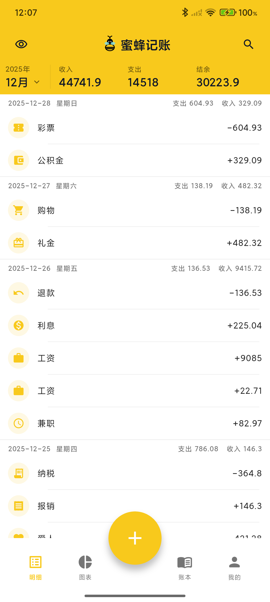
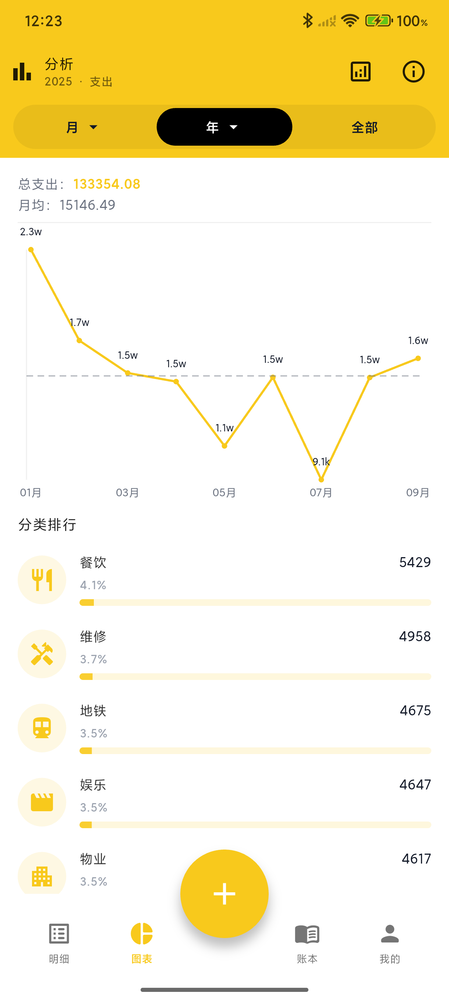

# 蜜蜂记账（BeeCount）

<div align="center">


**你的数据，你做主的开源记账应用**

**核心优势：支持自建 Supabase/WebDAV 服务器，数据完全掌控在你手中**

[📥 下载 APK](https://github.com/TNT-Likely/BeeCount/releases/latest) | [📖 使用文档](#-使用说明) | [💬 问题反馈](https://github.com/TNT-Likely/BeeCount/issues) | [🌐 English](README_EN.md)

</div>

---

> ## 🎉 重大消息
>
> **iOS TestFlight 筹款目标已达成！** 目标 $99，实际筹集 ¥732（101.67%）
>
> 🍎 **iOS 版本预计 5-7 天后通过 TestFlight 发布**

---

## 💡 为什么选择蜜蜂记账？

<table>
<tr>
<td width="50%">

### 🔒 传统记账应用的问题
- ❌ 数据存储在第三方服务器
- ❌ 隐私无法保证，可能被分析利用
- ❌ 服务商倒闭数据可能丢失
- ❌ 高级功能需要付费订阅
- ❌ 强制广告和理财产品推荐
- ❌ 闭源软件，无法审计代码

</td>
<td width="50%">

### ✅ 蜜蜂记账的优势
- ✅ **自建服务器**，数据完全自主
- ✅ **开源透明**，代码可审计
- ✅ **离线优先**，无网也能用
- ✅ **完全免费**，无广告无付费墙
- ✅ **隐私保护**，开发者无法访问你的数据
- ✅ **MIT 协议**，自由使用和修改

</td>
</tr>
</table>

一款轻量、开源、隐私可控的**个人财务管理**和**支出追踪** App，支持 iOS/Android 双平台。内置完整的账本管理、**收支记录**、分类统计、**图表分析**、数据导入导出功能，并支持自建 Supabase/WebDAV 云服务器同步。适合注重隐私的个人和家庭进行日常**费用记录**和**收支管理**。

## 📱 核心功能展示

<div align="center">
  
  
  
  
</div>

<details>
<summary>📸 查看更多截图</summary>

### 数据管理功能
<div align="center">
  
  
  
  
</div>

### 个性化与管理
<div align="center">
  
  
  
  
</div>

</details>

## 🌟 核心特性

### ☁️ 自建云服务 - 核心差异化优势

> **这是蜜蜂记账最大的特色：数据完全由你掌控！**

| 自建方案 | 适用场景 | 特点 |
|---------|---------|------|
| **Supabase** | 无 NAS 的用户 | 免费额度充足、配置简单、云端托管 |
| **WebDAV** | 有 NAS 的用户 | 数据完全本地化、支持群晖/绿联云/Nextcloud |

**为什么选择自建？**
- 🔐 **隐私第一**：开发者无法访问你的数据
- 💰 **成本可控**：Supabase 免费额度够用，WebDAV 一次性投入
- 🛡️ **数据安全**：不担心服务商倒闭或数据泄露
- 🔓 **开源审计**：所有云同步代码开源，可审计

[📖 查看云服务配置教程](#️-云备份配置可选)

### 🔒 数据安全与隐私

- **离线优先**：基于本地 SQLite，无网也能用
- **开源透明**：MIT 协议，代码可审计
- **可选同步**：不配置云服务也能完整使用
- **零追踪**：无统计、无广告、无数据收集

### 📊 完整记账功能

- **智能记账**：收入/支出分类、金额、日期、备注
- **多账本管理**：生活、工作、投资分开管理
- **图表分析**：月度报表、分类排行、趋势分析
- **数据导入导出**：CSV 格式，兼容主流应用

### 🎨 个性化与国际化

- **主题装扮**：多种主题色彩，打造专属风格
- **9 种语言**：简体中文、繁体中文、English、日本語、한국어、Español、Français、Deutsch
  - 完整界面翻译 + 智能分类映射
  - 本地化日期/数字格式
  - CSV 导入自动识别多语言分类

> 💡 需要添加新语言？欢迎在 [Issues](https://github.com/TNT-Likely/BeeCount/issues) 中提出！

## 🚀 快速开始

### 📥 方式一：直接下载（推荐）

<div align="center">

[](https://github.com/TNT-Likely/BeeCount/releases/latest)

</div>

**步骤：**
1. 点击上方按钮前往 [Releases](https://github.com/TNT-Likely/BeeCount/releases) 页面
2. 下载最新版本的 `app-prod-release-*.apk` 文件
3. 安装后即可开始使用（默认本地模式，无需任何配置）

> **iOS 用户**：需要 Apple 开发者账号签名，正在 [众筹中](#-支持项目)

### 🔨 方式二：自行构建

```bash
# 克隆项目
git clone https://github.com/TNT-Likely/BeeCount.git
cd BeeCount

# 安装依赖
flutter pub get
dart run build_runner build -d

# 运行应用
flutter run --flavor dev -d android --dart-define-from-file=assets/config.json
```

## 📖 使用说明

### 基础操作

- **添加记账**：点击首页底部的"+"按钮
- **编辑记录**：点击任意交易记录进入编辑页面
- **删除记录**：长按交易记录选择删除
- **切换月份**：点击顶部日期或在列表中上下滑动翻页
- **隐藏金额**：点击首页右上角眼睛图标

### 数据管理

- **导入数据**：个人中心 → 导入数据 → 选择 CSV 文件
- **导出备份**：个人中心 → 导出数据 → 选择导出格式
- **分类管理**：个人中心 → 分类管理 → 添加/编辑/删除分类
- **账本切换**：底部导航 → 账本 → 选择或创建新账本

## ☁️ 云备份配置（可选）

### 为什么选择自建云服务？

- **数据主权**：数据完全存储在你自己控制的服务器或云平台中
- **隐私保护**：开发者无法访问你的任何数据
- **成本可控**：大多数方案都提供免费额度或一次性购买
- **稳定可靠**：不依赖第三方托管服务，自主掌控
- **灵活选择**：根据自己的需求选择最合适的方案

### 方案一：自定义 Supabase（推荐新手）

**适用场景**：适合没有 NAS 设备，想要快速开始的用户

**配置步骤**：

1. **创建 Supabase 项目**
   - 访问 [supabase.com](https://supabase.com) 注册账号
   - 创建新项目，选择合适的区域
   - 在项目设置中获取 URL 和 anon key

2. **配置 Storage**
   - 在 Supabase 控制台创建名为 `beecount-backups` 的 Storage Bucket
   - 设置为 Private 并配置 RLS 访问策略

3. **应用内配置**
   - 打开蜜蜂记账 → 个人中心 → 云服务
   - 点击"添加自定义云服务"
   - 选择服务类型：**Supabase**
   - 填入你的 Supabase URL 和 anon key
   - 保存并启用配置
   - 点击"登录"，注册/登录账号后即可开始同步

### 方案二：WebDAV 服务器（推荐有 NAS 的用户）

**适用场景**：已有 NAS 设备或私有云存储的用户

**支持的服务**：
- ✅ 绿联云 NAS
- ✅ 群晖 Synology NAS
- ✅ Nextcloud
- ✅ 坚果云 WebDAV
- ✅ ownCloud
- ✅ 其他支持 WebDAV 协议的服务器

**配置步骤**：

1. **启用 WebDAV 服务**
   - 在 NAS 或云存储平台启用 WebDAV 功能
   - 记录 WebDAV 服务器地址（如 `http://nas.local:5005`）
   - 创建或使用现有的用户账号

2. **准备存储目录**（可选）
   - 在 WebDAV 根目录下创建 `BeeCount` 文件夹
   - 或使用任意路径（配置时指定即可）

3. **应用内配置**
   - 打开蜜蜂记账 → 个人中心 → 云服务
   - 点击"添加自定义云服务"
   - 选择服务类型：**WebDAV**
   - 填写配置信息：
     - **WebDAV 服务器 URL**：如 `http://nas.local:5005`
     - **用户名**：你的 WebDAV 用户名
     - **密码**：你的 WebDAV 密码
     - **远程路径**：存储路径（如 `/home/BeeCount` 或 `/BeeCount`）
   - 点击"测试连接"验证配置
   - 保存并启用配置
   - WebDAV 无需额外登录，配置后即可直接同步

**常见 WebDAV 配置示例**：

```
绿联云 NAS：
- URL: http://你的NAS地址:5005
- 远程路径: /home/BeeCount

群晖 NAS：
- URL: http://你的NAS地址:5005 或 https://你的域名
- 远程路径: /BeeCount

坚果云：
- URL: https://dav.jianguoyun.com/dav/
- 远程路径: /BeeCount
```

### 后续计划

我们将持续扩展云服务支持，计划添加：
- 📦 阿里云 OSS
- 📦 腾讯云 COS
- 📦 AWS S3
- 📦 Google Drive
- 📦 Dropbox
- 📦 更多...

如果你希望优先支持某个云服务，欢迎在 [Issues](https://github.com/TNT-Likely/BeeCount/issues) 中提出需求！

## 🛠️ 开发指南

### 技术栈

- **Flutter 3.27+**：跨平台 UI 框架
- **Riverpod**：状态管理解决方案
- **Drift (SQLite)**：本地数据库 ORM
- **Supabase**：云端备份和同步服务

### 项目结构

```
lib/
├── data/           # 数据模型和数据库操作
├── pages/          # 应用页面
├── widgets/        # 可复用组件
├── cloud/          # 云服务集成
├── l10n/           # 国际化资源
├── providers/      # Riverpod 状态提供者
└── utils/          # 工具函数
```

### 开发命令

```bash
# 安装依赖
flutter pub get

# 代码生成
dart run build_runner build --delete-conflicting-outputs

# 运行测试
flutter test

# 构建发布版本
flutter build apk --flavor prod --release
```

### 贡献指南

1. Fork 本项目
2. 创建特性分支 (`git checkout -b feature/AmazingFeature`)
3. 提交更改 (`git commit -m 'feat: 添加某个功能'`)
4. 推送到分支 (`git push origin feature/AmazingFeature`)
5. 创建 Pull Request

**提交规范**：使用中文提交信息，格式为 `类型: 简洁描述`

- `feat:` 新功能
- `fix:` 修复问题
- `refactor:` 代码重构
- `style:` 样式调整
- `docs:` 文档更新

## 📄 开源协议

本项目基于 [MIT 协议](LICENSE) 开源，你可以自由使用、修改和分发。

## ⚠️ 免责声明

- 本软件按"现状"提供，不提供任何明示或暗示的保证
- 使用本软件造成的数据丢失、经济损失等由使用者自行承担
- 请确保合法、合规地使用本软件

## 💬 常见问题

**Q: 不配置云服务能正常使用吗？**
A: 完全可以！应用默认使用本地存储，所有功能都能正常使用。你仍可随时导出 CSV 进行备份。

**Q: 应该选择 Supabase 还是 WebDAV？**
A:
- 如果你有 NAS 设备或私有云，推荐使用 WebDAV（数据完全本地化）
- 如果没有 NAS，推荐使用 Supabase（免费、稳定、易配置）
- 两者都支持完整的同步功能，可根据自己的需求选择

**Q: WebDAV 配置后为什么无法上传？**
A:
- 检查 WebDAV 服务是否启用且端口正确
- 确认用户名和密码正确
- 某些 NAS 的 WebDAV 需要在特定路径下才能写入（如绿联云需要 `/home/` 路径）
- 点击"测试连接"按钮查看详细错误信息

**Q: 配置自定义云服务后还能切回默认模式吗？**
A: 可以随时切换。已保存的自定义配置不会丢失，可以再次启用。

**Q: 如何确保数据安全？**
A:
- 使用自己的 Supabase 项目或 WebDAV 服务器
- 定期导出 CSV 备份到本地
- 使用强密码并开启两步验证（如果支持）
- WebDAV 建议使用 HTTPS 加密传输

**Q: 支持哪些数据格式？**
A: 目前支持 CSV 格式的导入导出，兼容大部分主流记账应用的数据格式。

**Q: 如何在多设备间同步数据？**
A:
- **Supabase**：在所有设备上配置相同的 URL 和 anon key，登录同一账号即可
- **WebDAV**：在所有设备上配置相同的 WebDAV 服务器地址和凭据即可

---

## 💝 支持项目

### 为什么需要您的支持？

蜜蜂记账是**完全免费开源**的项目，没有任何广告和付费功能。但要让 iOS 用户能够正常使用，需要申请 **Apple 开发者账号**（$99/年）来签名应用。

您的捐赠将直接用于：
- ✅ 申请 Apple 开发者账号（$99/年）
- ✅ 通过 TestFlight 分发 iOS 版本
- ✅ 维护项目的持续开发

### 捐赠方式

#### 🌍 国际用户

- **PayPal**: https://paypal.me/sunxiaoyes

#### 🇨🇳 中国用户

<details>
<summary>点击查看二维码</summary>

| 支付宝 | 微信支付 |
|:---:|:---:|
|  |  |

</details>

#### 🪙 加密货币

- **USDT (TRC20)**: `TKBV69B2AoU67p3vDhnJUbMJtZ1DxuUF5C`
- **币安**:

<details>
<summary>点击查看二维码</summary>


</details>

### 📊 筹款进度

- 🎯 **目标**: $99（约 ¥720，Apple 开发者账号年费）
- 💰 **已筹集**: ¥732（约 $101）
- 📈 **进度**: 101.67% ✅

```
进度条: [██████████] 101.67% - 🎉 已达成目标！
```

**目标已达成！接下来将**：
1. ✅ 注册 Apple 开发者账号（进行中）
2. ⏳ 配置签名证书和 TestFlight
3. ⏳ 通过 TestFlight 分发给 iOS 用户
4. ✅ 公开透明地说明资金使用情况

**资金使用说明**：
- Apple 开发者账号年费：¥720
- 多余资金（¥12）将用于：
  - 续费 Apple 开发者账号（下一年度）
  - 其他开发和维护必要费用（如域名、证书等）

### 🌟 感谢支持者

感谢以下朋友的慷慨支持（按捐赠时间排序）：

<!--
捐赠后请在 Issue 中留言或发邮件告知，我会将您添加到感谢名单中
格式：昵称 - 金额 - 日期
-->

- **\*桥** - ¥12 - 2025-10-27（微信）
- **\*睿** - ¥720 - 2025-10-27（微信）🎉

---

## 🙏 致谢

感谢所有为蜜蜂记账项目贡献代码、提出建议和反馈问题的朋友们！

如有问题或建议，欢迎在 [Issues](https://github.com/TNT-Likely/BeeCount/issues) 中提出，或在 [Discussions](https://github.com/TNT-Likely/BeeCount/discussions) 中参与讨论。

**蜜蜂记账 🐝 - 让记账变得简单而安全**
