# BeeCount

> [中文](README_CN.md) | English

**Your Data, Your Control - Open Source Accounting App**

A lightweight, open-source, privacy-focused personal accounting app for iOS/Android. Features complete ledger management, category statistics, data analysis, import/export functionality, and multiple cloud backup solutions. **Core Advantage: Support for custom Supabase backend and WebDAV servers, giving you complete control over your data.**

## 📱 Product Demo

### Core Features

<div align="center">
  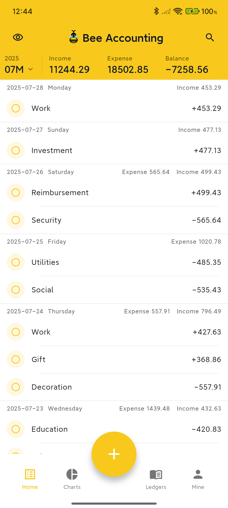
  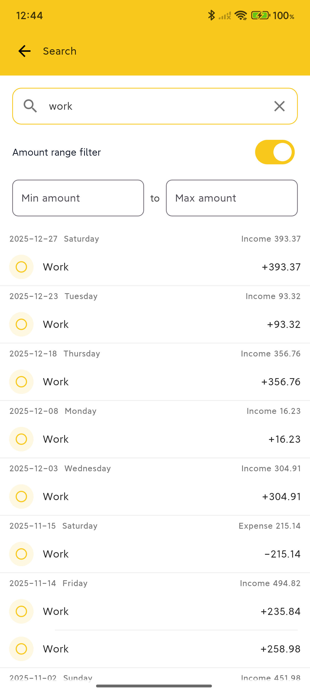
  
  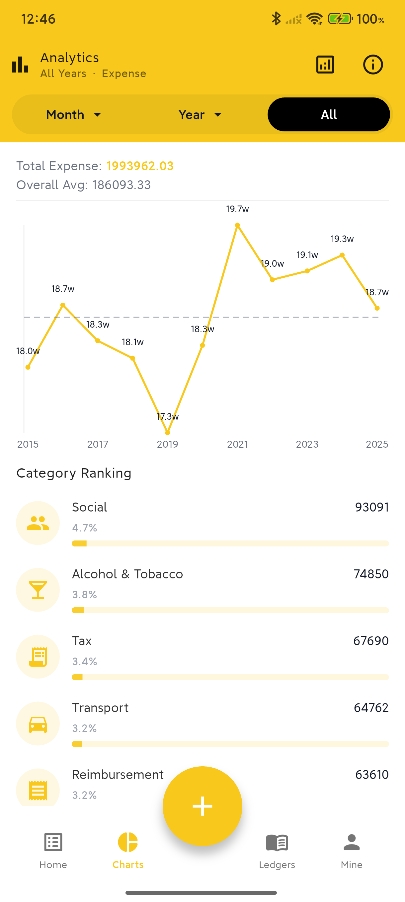
</div>

<div align="center">
  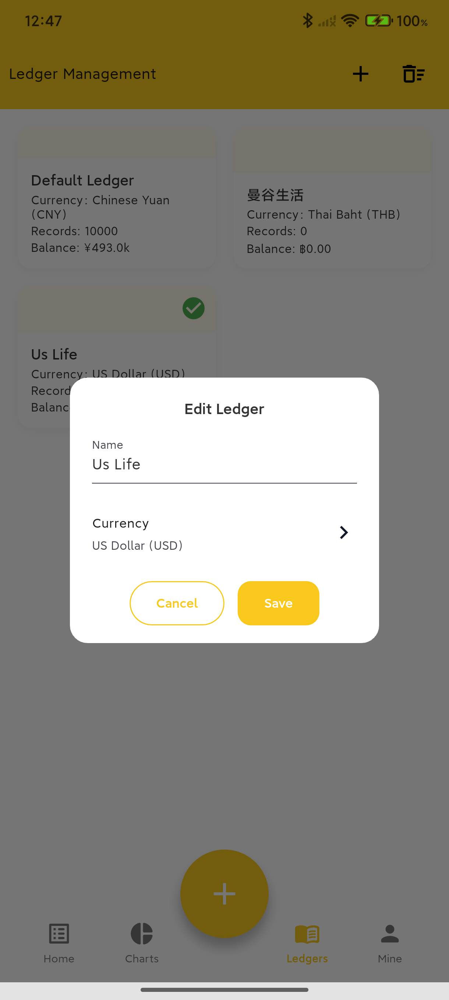
  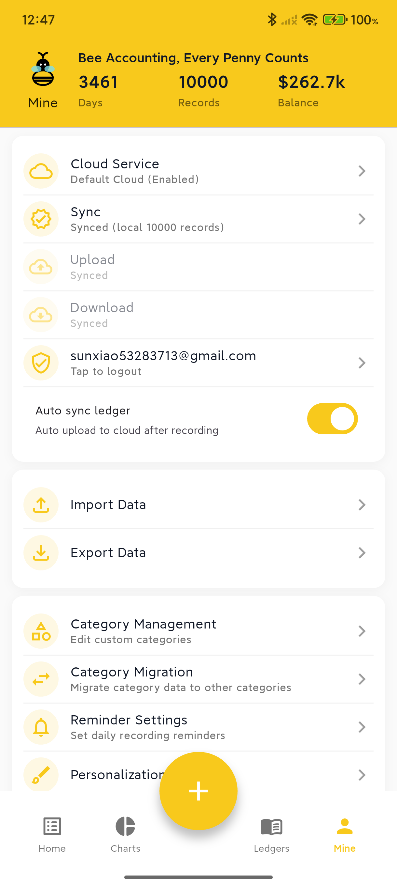
  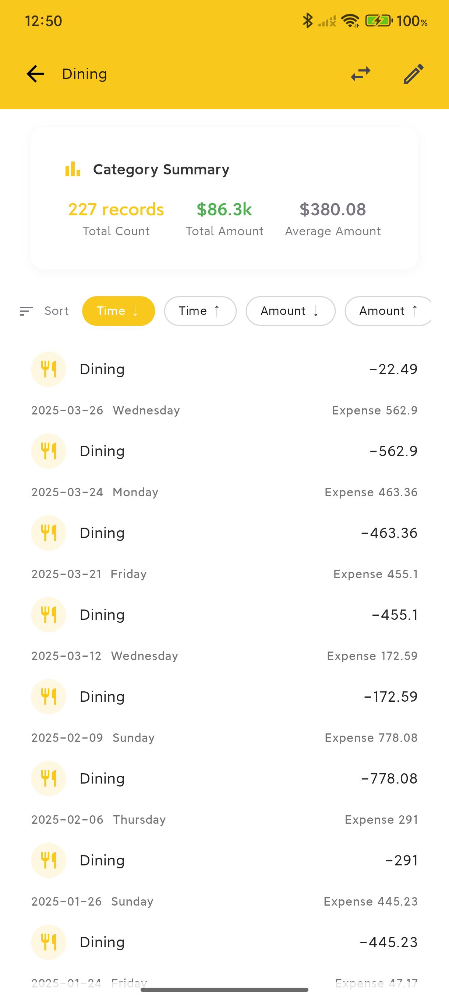
  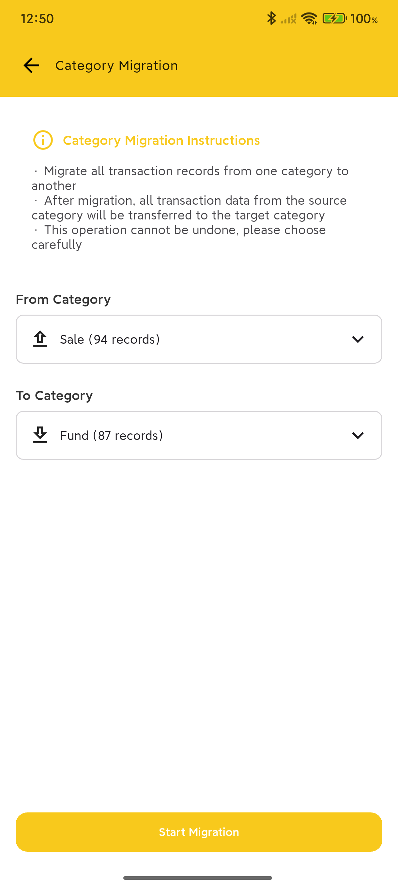
</div>

### Advanced Features

<div align="center">
  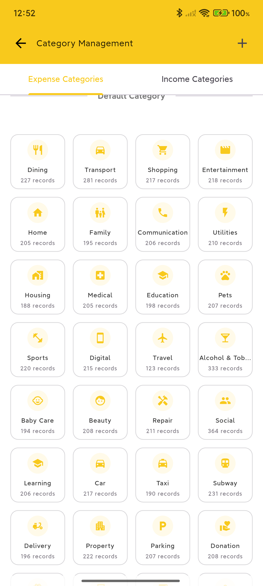
  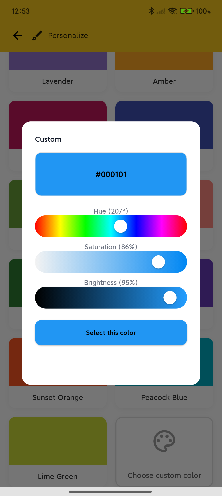
  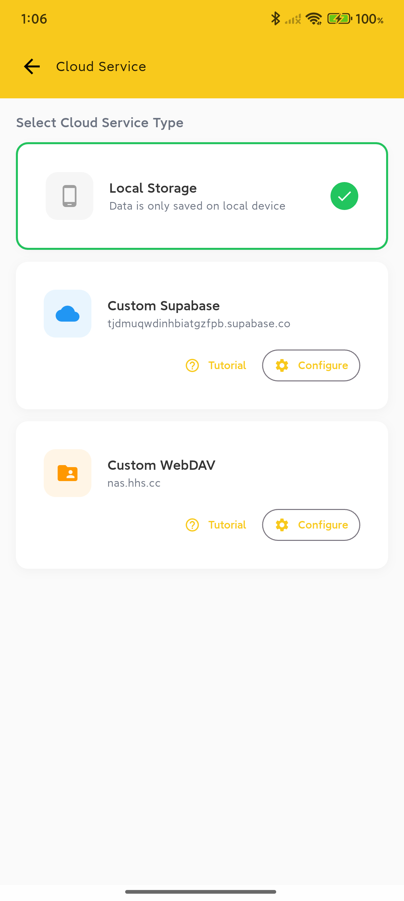
  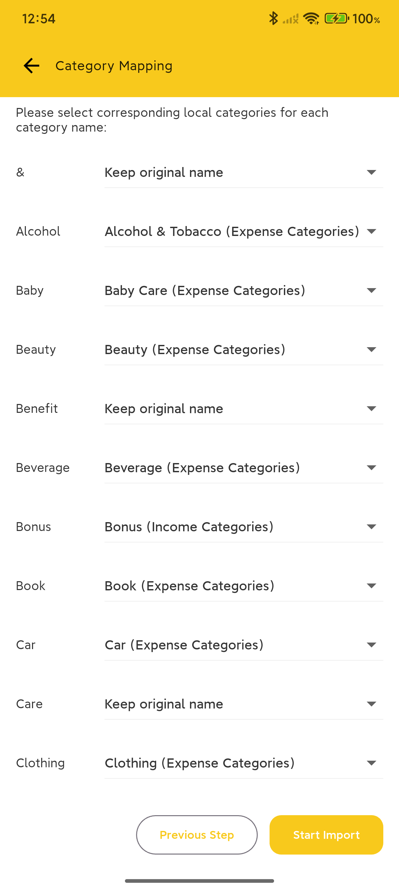
</div>

## 🌟 Key Features

### 🔒 Data Security & Privacy

- **Complete Autonomy**: Support for custom Supabase backend and WebDAV servers, data stored in locations you control
- **Open & Transparent**: Fully open-source code, auditable logic, no black boxes
- **Offline First**: Based on local SQLite database, works without network connection
- **Optional Sync**: Cloud sync is an enhancement feature, works completely without external services
- **Flexible Expansion**: Architecture designed to support more cloud service options in the future (e.g., Nutstore, Nextcloud, etc.)

### 📊 Complete Accounting Features

- **Smart Accounting**: Support for income/expense categories, amounts, dates, notes, and complete information
- **Multi-Ledger Management**: Create multiple ledgers for different scenarios like personal, work, etc.
- **Category Statistics**: Automatically generate monthly income/expense reports, category rankings, trend analysis
- **Data Analysis**: Intuitive charts to help understand spending habits and financial status

### 🔄 Data Management

- **CSV Import/Export**: Support migration from other accounting apps or regular backups
- **Multiple Cloud Backup Solutions**:
  - Custom Supabase project
  - WebDAV servers (supports UGREEN Cloud, Synology NAS, Nextcloud, etc.)
  - More services coming soon...
- **Multi-Device Sync**: Configure same cloud service to sync data across multiple devices
- **Category Migration**: Support batch migration of transaction records to other categories

### 🎨 Personalization

- **Theme Customization**: Multiple theme colors available to create your personal interface style
- **Multi-Language Support**: Supports 8 language interface switching, covering major international languages
- **Flexible Configuration**: Adjust various usage preferences according to personal habits

### 🌍 Internationalization Support

- **Supported Languages**:
  - Simplified Chinese 🇨🇳
  - Traditional Chinese 🇨🇳
  - English 🇬🇧
  - 日本語 🇯🇵
  - 한국어 🇰🇷
  - Español 🇪🇸
  - Français 🇫🇷
  - Deutsch 🇩🇪
- **Language Features**:
  - Complete interface translation including all menus, buttons, and prompts
  - Smart category name translation and mapping
  - Localized date and number format display
  - Automatic recognition and matching of multi-language category names during CSV import
  - Support for system follow or manual language selection

> If you'd like to add support for a new language, welcome to create an issue or submit a PR directly!

## 🚀 Quick Start

### Option 1: Direct Installation (Recommended)

1. Go to the [Releases](https://github.com/TNT-Likely/BeeCount/releases) page
2. Download the latest `app-prod-release-*.apk` file
3. Install and start using (default local mode, no configuration needed)

### Option 2: Build from Source

```bash
# Clone the project
git clone https://github.com/TNT-Likely/BeeCount.git
cd BeeCount

# Install dependencies
flutter pub get
dart run build_runner build -d

# Run the app
flutter run --flavor dev -d android --dart-define-from-file=assets/config.json
```

## 📖 User Guide

### Basic Operations

- **Add Transaction**: Tap the "+" button at the bottom of the home screen
- **Edit Record**: Tap any transaction record to enter edit page
- **Delete Record**: Long press transaction record to select delete
- **Switch Months**: Tap the date at the top or scroll up/down in the list to flip pages
- **Hide Amounts**: Tap the eye icon in the top right of the home screen

### Data Management

- **Import Data**: Profile → Import Data → Select CSV file
- **Export Backup**: Profile → Export Data → Select export format
- **Category Management**: Profile → Category Management → Add/Edit/Delete categories
- **Ledger Switching**: Bottom navigation → Ledgers → Select or create new ledger

## ☁️ Cloud Backup Configuration (Optional)

### Why Choose Self-Hosted Cloud Service?

- **Data Sovereignty**: Data completely stored in servers or cloud platforms you control
- **Privacy Protection**: Developers cannot access any of your data
- **Cost Control**: Most solutions offer free tiers or one-time purchase options
- **Stable & Reliable**: No dependency on third-party hosting services, full control
- **Flexible Choice**: Choose the most suitable solution based on your needs

### Option 1: Custom Supabase (Recommended for Beginners)

**Use Case**: Suitable for users without NAS devices who want to get started quickly

**Configuration Steps**:

1. **Create Supabase Project**
   - Visit [supabase.com](https://supabase.com) to register an account
   - Create a new project, select appropriate region
   - Get URL and anon key from project settings

2. **Configure Storage**
   - Create a Storage Bucket named `beecount-backups` in Supabase console
   - Set as Private and configure RLS access policies

3. **App Configuration**
   - Open BeeCount → Profile → Cloud Service
   - Tap "Add Custom Cloud Service"
   - Select service type: **Supabase**
   - Enter your Supabase URL and anon key
   - Save and enable configuration
   - Tap "Login", register/sign in and start syncing

### Option 2: WebDAV Server (Recommended for NAS Users)

**Use Case**: For users with NAS devices or private cloud storage

**Supported Services**:
- ✅ UGREEN Cloud NAS
- ✅ Synology NAS
- ✅ Nextcloud
- ✅ Nutstore WebDAV
- ✅ ownCloud
- ✅ Any server supporting WebDAV protocol

**Configuration Steps**:

1. **Enable WebDAV Service**
   - Enable WebDAV functionality on your NAS or cloud storage platform
   - Note the WebDAV server address (e.g., `http://nas.local:5005`)
   - Create or use existing user account

2. **Prepare Storage Directory** (Optional)
   - Create a `BeeCount` folder in WebDAV root directory
   - Or use any path (specify during configuration)

3. **App Configuration**
   - Open BeeCount → Profile → Cloud Service
   - Tap "Add Custom Cloud Service"
   - Select service type: **WebDAV**
   - Fill in configuration:
     - **WebDAV Server URL**: e.g., `http://nas.local:5005`
     - **Username**: Your WebDAV username
     - **Password**: Your WebDAV password
     - **Remote Path**: Storage path (e.g., `/home/BeeCount` or `/BeeCount`)
   - Tap "Test Connection" to verify configuration
   - Save and enable configuration
   - WebDAV requires no additional login, can sync directly after configuration

**Common WebDAV Configuration Examples**:

```
UGREEN Cloud NAS:
- URL: http://your-nas-address:5005
- Remote Path: /home/BeeCount

Synology NAS:
- URL: http://your-nas-address:5005 or https://your-domain
- Remote Path: /BeeCount

Nutstore:
- URL: https://dav.jianguoyun.com/dav/
- Remote Path: /BeeCount
```

### Future Plans

We will continue expanding cloud service support, planning to add:
- 📦 Alibaba Cloud OSS
- 📦 Tencent Cloud COS
- 📦 AWS S3
- 📦 Google Drive
- 📦 Dropbox
- 📦 More...

If you'd like to prioritize support for a specific cloud service, welcome to create a feature request in [Issues](https://github.com/TNT-Likely/BeeCount/issues)!

## 🛠️ Development Guide

### Tech Stack

- **Flutter 3.27+**: Cross-platform UI framework
- **Riverpod**: State management solution
- **Drift (SQLite)**: Local database ORM
- **Supabase**: Cloud backup and sync service

### Project Structure

```
lib/
├── data/           # Data models and database operations
├── pages/          # Application pages
├── widgets/        # Reusable components
├── cloud/          # Cloud service integration
├── l10n/           # Internationalization resources
├── providers/      # Riverpod state providers
└── utils/          # Utility functions
```

### Development Commands

```bash
# Install dependencies
flutter pub get

# Code generation
dart run build_runner build --delete-conflicting-outputs

# Run tests
flutter test

# Build release version
flutter build apk --flavor prod --release
```

### Contribution Guidelines

1. Fork this project
2. Create feature branch (`git checkout -b feature/AmazingFeature`)
3. Commit changes (`git commit -m 'feat: add some feature'`)
4. Push to branch (`git push origin feature/AmazingFeature`)
5. Create Pull Request

**Commit Convention**: Use Chinese commit messages in format `type: brief description`
- `feat:` New feature
- `fix:` Bug fix
- `refactor:` Code refactoring
- `style:` Style adjustments
- `docs:` Documentation updates

## 📄 Open Source License

This project is open-sourced under the [MIT License](LICENSE). You are free to use, modify, and distribute.

## ⚠️ Disclaimer

- This software is provided "as is" without any express or implied warranties
- Users are responsible for any data loss or financial loss caused by using this software
- Please ensure legal and compliant use of this software

## 💬 FAQ

**Q: Can I use it normally without configuring cloud services?**
A: Absolutely! The app uses local storage by default, and all features work normally. You can still export CSV backups at any time.

**Q: Should I choose Supabase or WebDAV?**
A:
- If you have a NAS device or private cloud, we recommend WebDAV (fully localized data)
- If you don't have a NAS, we recommend Supabase (free, stable, easy to configure)
- Both support complete sync functionality, choose based on your needs

**Q: Why can't I upload after configuring WebDAV?**
A:
- Check if WebDAV service is enabled and port is correct
- Verify username and password are correct
- Some NAS WebDAV requires specific paths for write access (e.g., UGREEN Cloud requires `/home/` path)
- Click "Test Connection" button to view detailed error messages

**Q: Can I switch back to default mode after configuring custom cloud service?**
A: Yes, you can switch anytime. The saved custom configuration won't be lost and can be re-enabled.

**Q: How to ensure data security?**
A:
- Use your own Supabase project or WebDAV server
- Regularly export CSV backups to local storage
- Use strong passwords and enable two-factor authentication (if supported)
- For WebDAV, recommend using HTTPS for encrypted transmission

**Q: What data formats are supported?**
A: Currently supports CSV format for import/export, compatible with data formats from most mainstream accounting apps.

**Q: How to sync data across multiple devices?**
A:
- **Supabase**: Configure same URL and anon key on all devices, log in with same account
- **WebDAV**: Configure same WebDAV server address and credentials on all devices

---

## 🙏 Acknowledgments

Thanks to all friends who have contributed code, suggestions, and feedback to the BeeCount project!

If you have questions or suggestions, feel free to raise them in [Issues](https://github.com/TNT-Likely/BeeCount/issues) or participate in discussions at [Discussions](https://github.com/TNT-Likely/BeeCount/discussions).

**BeeCount 🐝 - Making Accounting Simple and Secure**