# BeeCount

<div align="center">


**Your Data, Your Control - Open Source Accounting App**

**Core Advantage: Self-hosted Supabase/WebDAV servers - Your data, Your control**

[📥 Download APK](https://github.com/TNT-Likely/BeeCount/releases/latest) | [📖 Documentation](#-user-guide) | [💬 Issues](https://github.com/TNT-Likely/BeeCount/issues) | [🇨🇳 中文](README.md)

</div>

---

> ## 🎉 Great News
>
> **iOS TestFlight funding goal achieved!** Target $99, raised ¥732 ($101, 101.67%)
>
> 🍎 **iOS version will be available via TestFlight in 5-7 days**

---

## 💡 Why Choose BeeCount?

<table>
<tr>
<td width="50%">

### 🔒 Problems with Traditional Apps
- ❌ Data stored on third-party servers
- ❌ Privacy risks, data may be analyzed
- ❌ Data loss if service shuts down
- ❌ Premium features behind paywalls
- ❌ Forced ads and loan recommendations
- ❌ Closed-source, cannot audit code

</td>
<td width="50%">

### ✅ BeeCount Advantages
- ✅ **Self-hosted**, complete data control
- ✅ **Open source**, auditable code
- ✅ **Offline-first**, works without network
- ✅ **Completely free**, no ads or paywalls
- ✅ **Privacy-first**, developers cannot access your data
- ✅ **MIT License**, free to use and modify

</td>
</tr>
</table>

A lightweight, open-source, privacy-focused **personal finance management** and **expense tracker** app for iOS/Android. Features complete ledger management, **income and expense tracking**, category statistics, **chart analysis**, data import/export, and self-hosted Supabase/WebDAV cloud sync. Perfect for privacy-conscious individuals and families to manage daily **spending** and **budget tracking**.

## 📱 Core Features Showcase

<div align="center">
  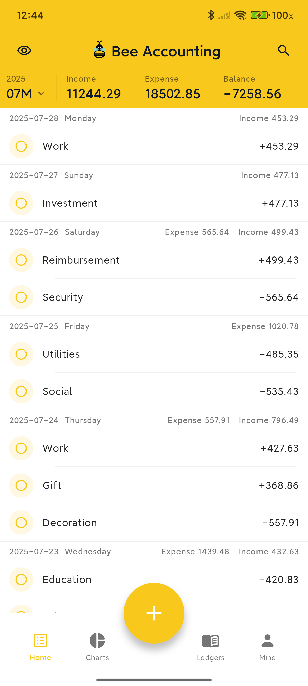
  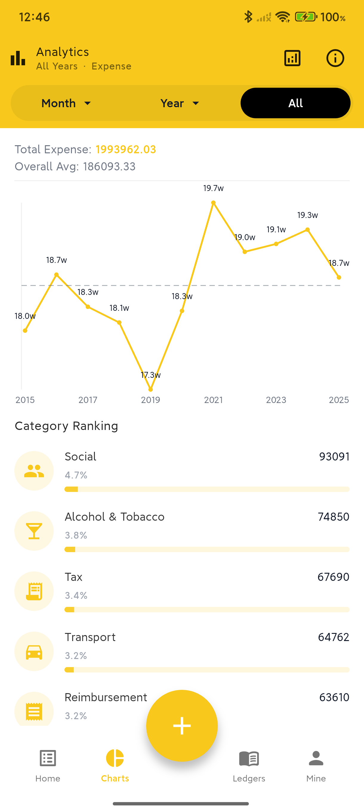
  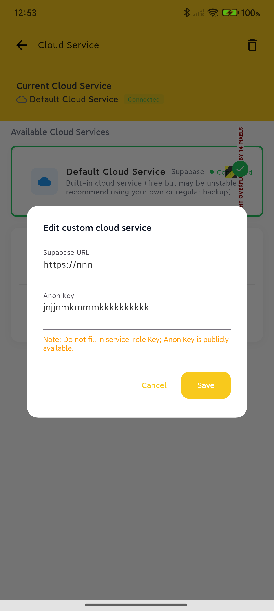
  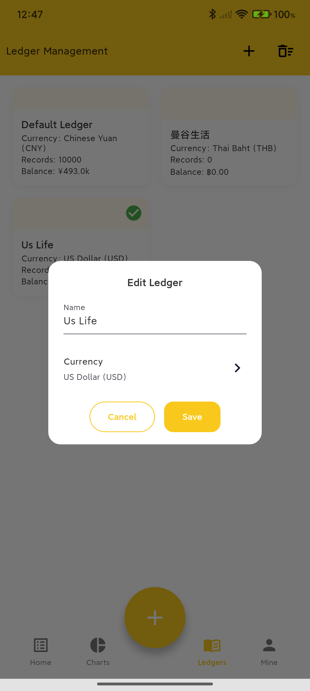
</div>

<details>
<summary>📸 View More Screenshots</summary>

### Data Management
<div align="center">
  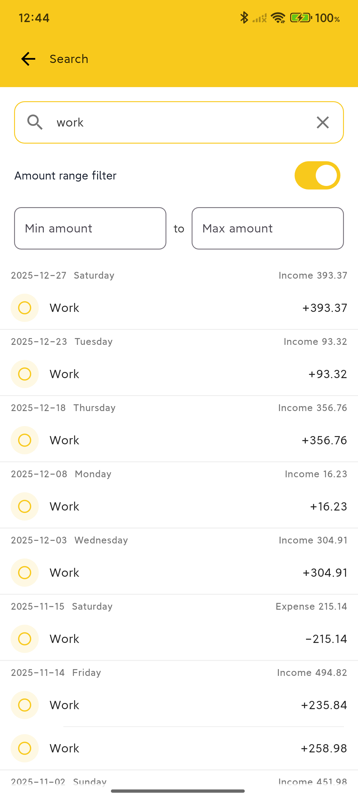
  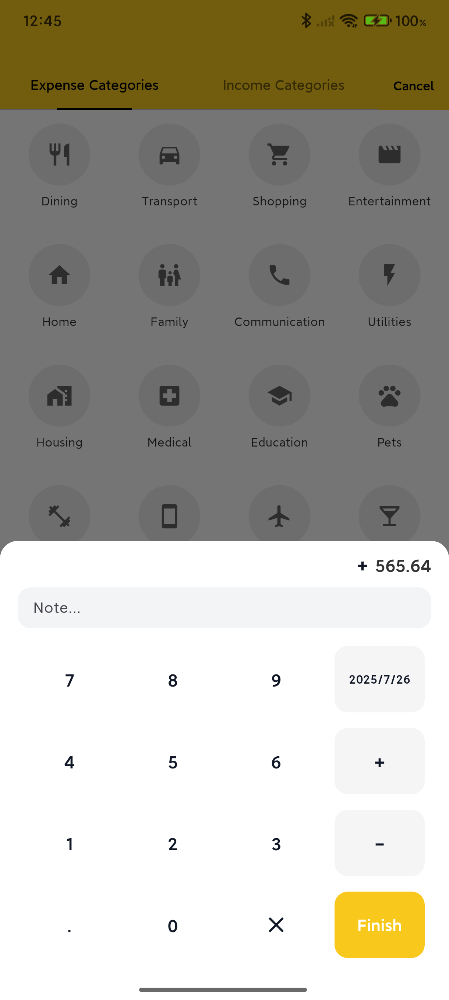
  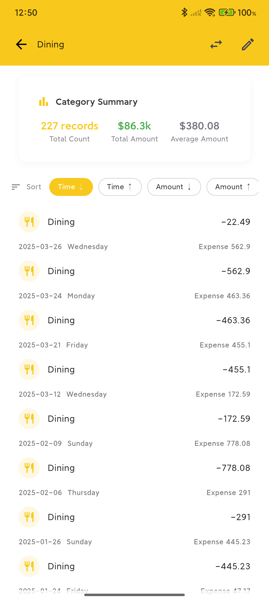
  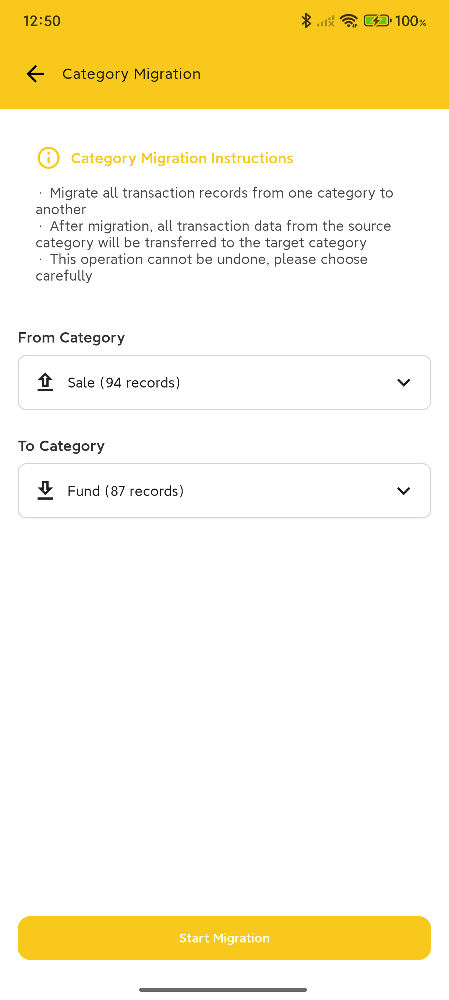
</div>

### Personalization & Management
<div align="center">
  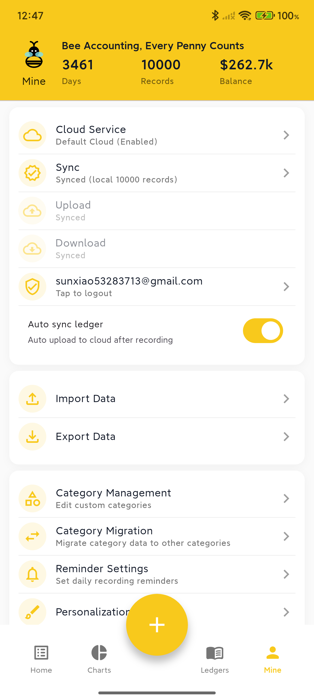
  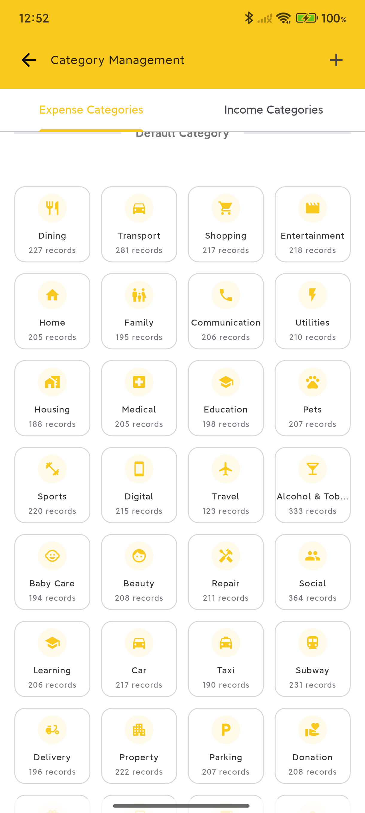
  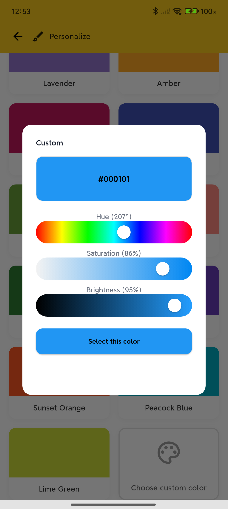
  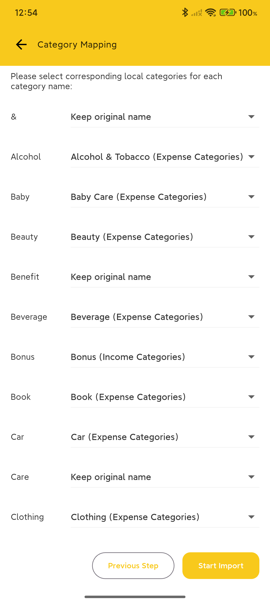
</div>

</details>

## 🌟 Key Features

### ☁️ Self-Hosted Cloud Service - Core Differentiator

> **This is BeeCount's biggest feature: Complete control over your data!**

| Solution | Best For | Features |
|----------|----------|----------|
| **Supabase** | Users without NAS | Free tier sufficient, easy setup, cloud-hosted |
| **WebDAV** | Users with NAS | Fully localized data, supports Synology/UGREEN/Nextcloud |

**Why Self-Hosted?**
- 🔐 **Privacy First**: Developers cannot access your data
- 💰 **Cost Effective**: Supabase free tier sufficient, WebDAV one-time investment
- 🛡️ **Data Security**: No worries about service shutdowns or data breaches
- 🔓 **Open Source**: All cloud sync code is open source and auditable

[📖 View Cloud Service Setup Guide](#️-cloud-backup-configuration-optional)

### 🔒 Data Security & Privacy

- **Offline First**: Based on local SQLite, works without network
- **Open & Transparent**: MIT License, auditable code
- **Optional Sync**: Works completely without cloud configuration
- **Zero Tracking**: No analytics, no ads, no data collection

### 📊 Complete Accounting Features

- **Smart Accounting**: Income/expense categories, amounts, dates, notes
- **Multi-Ledger Management**: Separate management for personal, work, investment
- **Chart Analysis**: Monthly reports, category rankings, trend analysis
- **Data Import/Export**: CSV format, compatible with mainstream apps

### 🎨 Personalization & Internationalization

- **Theme Customization**: Multiple theme colors for personalized style
- **9 Languages**: Simplified Chinese, Traditional Chinese, English, 日本語, 한국어, Español, Français, Deutsch
  - Complete UI translation + smart category mapping
  - Localized date/number formats
  - CSV import auto-recognizes multi-language categories

> 💡 Want to add a new language? Welcome to create an [Issue](https://github.com/TNT-Likely/BeeCount/issues)!

## 🚀 Quick Start

### 📥 Option 1: Direct Download (Recommended)

<div align="center">

[](https://github.com/TNT-Likely/BeeCount/releases/latest)

</div>

**Steps:**

1. Click the button above to go to [Releases](https://github.com/TNT-Likely/BeeCount/releases) page
2. Download the latest `app-prod-release-*.apk` file
3. Install and start using (default local mode, no configuration needed)

> **iOS Users**: Requires Apple Developer Account for signing, currently [crowdfunding](#-support-this-project)

### 🔨 Option 2: Build from Source

```bash
# Clone the project
git clone https://github.com/TNT-Likely/BeeCount.git
cd BeeCount

# Install dependencies
flutter pub get
dart run build_runner build -d

# Run the app
flutter run --flavor dev -d android --dart-define-from-file=assets/config.json
```

## 📖 User Guide

### Basic Operations

- **Add Transaction**: Tap the "+" button at the bottom of the home screen
- **Edit Record**: Tap any transaction record to enter edit page
- **Delete Record**: Long press transaction record to select delete
- **Switch Months**: Tap the date at the top or scroll up/down in the list to flip pages
- **Hide Amounts**: Tap the eye icon in the top right of the home screen

### Data Management

- **Import Data**: Profile → Import Data → Select CSV file
- **Export Backup**: Profile → Export Data → Select export format
- **Category Management**: Profile → Category Management → Add/Edit/Delete categories
- **Ledger Switching**: Bottom navigation → Ledgers → Select or create new ledger

## ☁️ Cloud Backup Configuration (Optional)

### Why Choose Self-Hosted Cloud Service?

- **Data Sovereignty**: Data completely stored in servers or cloud platforms you control
- **Privacy Protection**: Developers cannot access any of your data
- **Cost Control**: Most solutions offer free tiers or one-time purchase options
- **Stable & Reliable**: No dependency on third-party hosting services, full control
- **Flexible Choice**: Choose the most suitable solution based on your needs

### Option 1: Custom Supabase (Recommended for Beginners)

**Use Case**: Suitable for users without NAS devices who want to get started quickly

**Configuration Steps**:

1. **Create Supabase Project**
   - Visit [supabase.com](https://supabase.com) to register an account
   - Create a new project, select appropriate region
   - Get URL and anon key from project settings

2. **Configure Storage**
   - Create a Storage Bucket named `beecount-backups` in Supabase console
   - Set as Private and configure RLS access policies

3. **App Configuration**
   - Open BeeCount → Profile → Cloud Service
   - Tap "Add Custom Cloud Service"
   - Select service type: **Supabase**
   - Enter your Supabase URL and anon key
   - Save and enable configuration
   - Tap "Login", register/sign in and start syncing

### Option 2: WebDAV Server (Recommended for NAS Users)

**Use Case**: For users with NAS devices or private cloud storage

**Supported Services**:
- ✅ UGREEN Cloud NAS
- ✅ Synology NAS
- ✅ Nextcloud
- ✅ Nutstore WebDAV
- ✅ ownCloud
- ✅ Any server supporting WebDAV protocol

**Configuration Steps**:

1. **Enable WebDAV Service**
   - Enable WebDAV functionality on your NAS or cloud storage platform
   - Note the WebDAV server address (e.g., `http://nas.local:5005`)
   - Create or use existing user account

2. **Prepare Storage Directory** (Optional)
   - Create a `BeeCount` folder in WebDAV root directory
   - Or use any path (specify during configuration)

3. **App Configuration**
   - Open BeeCount → Profile → Cloud Service
   - Tap "Add Custom Cloud Service"
   - Select service type: **WebDAV**
   - Fill in configuration:
     - **WebDAV Server URL**: e.g., `http://nas.local:5005`
     - **Username**: Your WebDAV username
     - **Password**: Your WebDAV password
     - **Remote Path**: Storage path (e.g., `/home/BeeCount` or `/BeeCount`)
   - Tap "Test Connection" to verify configuration
   - Save and enable configuration
   - WebDAV requires no additional login, can sync directly after configuration

**Common WebDAV Configuration Examples**:

```
UGREEN Cloud NAS:
- URL: http://your-nas-address:5005
- Remote Path: /home/BeeCount

Synology NAS:
- URL: http://your-nas-address:5005 or https://your-domain
- Remote Path: /BeeCount

Nutstore:
- URL: https://dav.jianguoyun.com/dav/
- Remote Path: /BeeCount
```

### Future Plans

We will continue expanding cloud service support, planning to add:
- 📦 Alibaba Cloud OSS
- 📦 Tencent Cloud COS
- 📦 AWS S3
- 📦 Google Drive
- 📦 Dropbox
- 📦 More...

If you'd like to prioritize support for a specific cloud service, welcome to create a feature request in [Issues](https://github.com/TNT-Likely/BeeCount/issues)!

## 🛠️ Development Guide

### Tech Stack

- **Flutter 3.27+**: Cross-platform UI framework
- **Riverpod**: State management solution
- **Drift (SQLite)**: Local database ORM
- **Supabase**: Cloud backup and sync service

### Project Structure

```
lib/
├── data/           # Data models and database operations
├── pages/          # Application pages
├── widgets/        # Reusable components
├── cloud/          # Cloud service integration
├── l10n/           # Internationalization resources
├── providers/      # Riverpod state providers
└── utils/          # Utility functions
```

### Development Commands

```bash
# Install dependencies
flutter pub get

# Code generation
dart run build_runner build --delete-conflicting-outputs

# Run tests
flutter test

# Build release version
flutter build apk --flavor prod --release
```

### Contribution Guidelines

1. Fork this project
2. Create feature branch (`git checkout -b feature/AmazingFeature`)
3. Commit changes (`git commit -m 'feat: add some feature'`)
4. Push to branch (`git push origin feature/AmazingFeature`)
5. Create Pull Request

**Commit Convention**: Use Chinese commit messages in format `type: brief description`
- `feat:` New feature
- `fix:` Bug fix
- `refactor:` Code refactoring
- `style:` Style adjustments
- `docs:` Documentation updates

## 📄 Open Source License

This project is open-sourced under the [MIT License](LICENSE). You are free to use, modify, and distribute.

## ⚠️ Disclaimer

- This software is provided "as is" without any express or implied warranties
- Users are responsible for any data loss or financial loss caused by using this software
- Please ensure legal and compliant use of this software

## 💬 FAQ

**Q: Can I use it normally without configuring cloud services?**
A: Absolutely! The app uses local storage by default, and all features work normally. You can still export CSV backups at any time.

**Q: Should I choose Supabase or WebDAV?**
A:
- If you have a NAS device or private cloud, we recommend WebDAV (fully localized data)
- If you don't have a NAS, we recommend Supabase (free, stable, easy to configure)
- Both support complete sync functionality, choose based on your needs

**Q: Why can't I upload after configuring WebDAV?**
A:
- Check if WebDAV service is enabled and port is correct
- Verify username and password are correct
- Some NAS WebDAV requires specific paths for write access (e.g., UGREEN Cloud requires `/home/` path)
- Click "Test Connection" button to view detailed error messages

**Q: Can I switch back to default mode after configuring custom cloud service?**
A: Yes, you can switch anytime. The saved custom configuration won't be lost and can be re-enabled.

**Q: How to ensure data security?**
A:
- Use your own Supabase project or WebDAV server
- Regularly export CSV backups to local storage
- Use strong passwords and enable two-factor authentication (if supported)
- For WebDAV, recommend using HTTPS for encrypted transmission

**Q: What data formats are supported?**
A: Currently supports CSV format for import/export, compatible with data formats from most mainstream accounting apps.

**Q: How to sync data across multiple devices?**
A:
- **Supabase**: Configure same URL and anon key on all devices, log in with same account
- **WebDAV**: Configure same WebDAV server address and credentials on all devices

---

## 💝 Support This Project

### Why We Need Your Support?

BeeCount is a **completely free and open-source** project with no ads or paid features. However, to make it available for iOS users, we need an **Apple Developer Account** ($99/year) to sign the app.

Your donation will be used for:
- ✅ Apple Developer Account annual fee ($99/year)
- ✅ Distributing iOS version via TestFlight
- ✅ Continuous project development and maintenance

### Donation Methods

#### 🌍 International

- **PayPal**: https://paypal.me/sunxiaoyes

#### 🇨🇳 China

<details>
<summary>Click to view QR codes</summary>

| Alipay | WeChat Pay |
|:---:|:---:|
|  |  |

</details>

#### 🪙 Cryptocurrency

- **USDT (TRC20)**: `TKBV69B2AoU67p3vDhnJUbMJtZ1DxuUF5C`
- **Binance**:

<details>
<summary>Click to view QR code</summary>


</details>

### 📊 Funding Progress

- 🎯 **Goal**: $99 (Apple Developer Account annual fee)
- 💰 **Raised**: ¥732 (≈ $101)
- 📈 **Progress**: 101.67% ✅

```
Progress: [██████████] 101.67% - 🎉 Goal Achieved!
```

**Goal achieved! Next steps**:
1. ✅ Register Apple Developer Account (in progress)
2. ⏳ Configure signing certificates and TestFlight
3. ⏳ Distribute to iOS users via TestFlight
4. ✅ Transparently report fund usage

**Fund Usage**:
- Apple Developer Account annual fee: ¥720
- Surplus funds (¥12) will be used for:
  - Renewing Apple Developer Account (next year)
  - Other necessary development and maintenance expenses (e.g., domain, certificates)

### 🌟 Special Thanks to Our Supporters

Thank you to the following generous supporters (in chronological order):

<!--
After donating, please leave a message in Issues or send an email, and we'll add you to the list
Format: Nickname - Amount - Date
-->

- **\*Qiao** - ¥12 - 2025-10-27 (WeChat)
- **\*Rui** - ¥720 - 2025-10-27 (WeChat) 🎉

---

## 🙏 Acknowledgments

Thanks to all friends who have contributed code, suggestions, and feedback to the BeeCount project!

If you have questions or suggestions, feel free to raise them in [Issues](https://github.com/TNT-Likely/BeeCount/issues) or participate in discussions at [Discussions](https://github.com/TNT-Likely/BeeCount/discussions).

**BeeCount 🐝 - Making Accounting Simple and Secure**